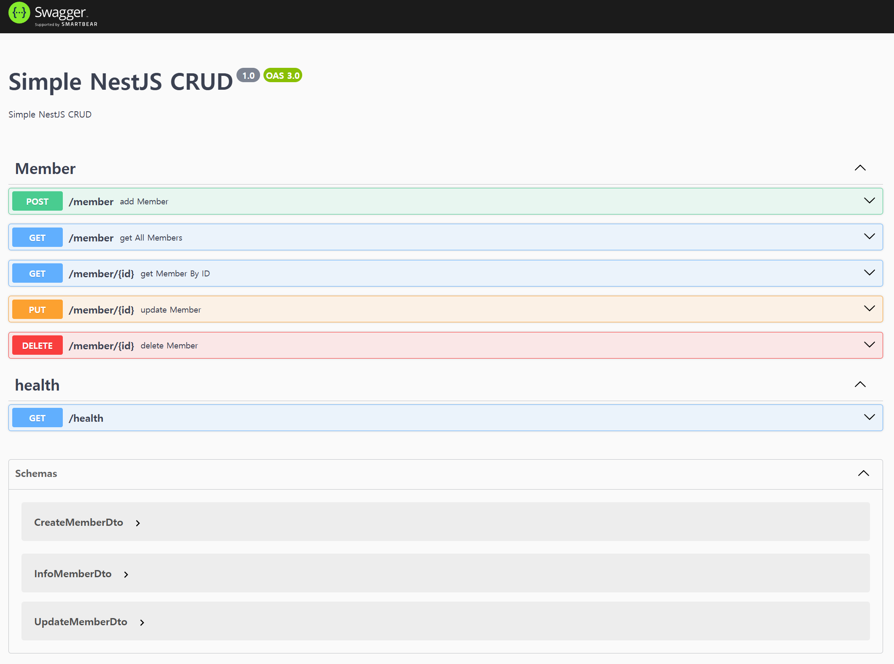

# Simple NestJS CRUD Example

## 📌 Features

- 240803 created, node v20.16.0, "nestjs" : "^10.0.0", "prisma": "^5.17.0"
    - PostgreSQL
    - Create an initial user
    - endpoints CRUD
        - member
    - API healthcheck
    - Complete swagger Api info
      - [Swagger](http://localhost:3000/swagger)
        - `http://localhost:3000/swagger`
      - [OpenAPI](http://localhost:3000/openapi.json)
        - `http://localhost:3000/openapi.json`



## 💾 Installation

```bash
yarn install
```

## 🔧 Config

- `.env.example`을 복사, 참고 하여 `.env` 파일 작성
  - 별도 수정 없이 docker 내에서 실행 시, `DATABASE_URL`의 `localhost` ->`host.docker.internal` || `postgres`

## 🏃 Run

```bash
# http
yarn run start

# dev 
yarn run start:dev

# docker 
docker-compose up --build -d

# db only
docker run -e POSTGRES_PASSWORD=postgres -e POSTGRES_USER=postgres -e POSTGRES_DATABASE=postgres -e -p 5432:5432 --name postgres -d postgres
```